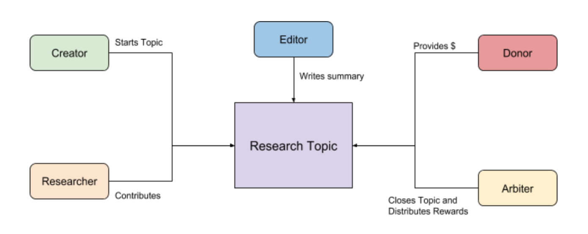

# Decentralized Research Collaboration

One of the core flows that we want to test is decentralized research collaboration. So we’re specifying a very minimal initial research network based on bounties, to build as one of our first MVPs.

# Network participants

**Creators**: Creates research topics and direct the attention of other researchers. A research topic is a self-contained scientific question, hypothesis or problem to solve. A Creator is just a Researcher with extra privileges within a specific research topic. They get rewarded with a percentage of the funds secured.

**Researchers**: Contribute to research topics to help answer or solve them. There is a percentage of the funds secured in a research topic that get distributed amongst researchers, depending on the impact of their contributions.

**Arbiters**: Third parties with knowledge and reputation in the research field corresponding to a research topic. They get rewarded with a percentage of the funds secured.

**Editor**: Write papers that communicate the findings that come from a research topic. They get rewarded with a percentage of the funds secured.

**Donors**: Provide funds to incentivize researchers to contribute to a particular research topic.

## Research Topic Flow

###Topic Creation
To start the research initiative, a Creator launches a new ResearchTopic. She needs to include:

-   An Arbiter that will mediate the topic. The Arbiter’s address could easily be a multisig with multiple arbiters behind it. The Creator is incentivized to pick trusted and knowledgeable Arbiters in order to gather research talent and secure funds.
-   Hypothesis / Question / Problem
-   Description (Extra info)
-   Percentage of reward that will go to the Editor
-   Percentage of rewards that will go to the Arbiter.
-   Percentage of rewards that the Creator will keep

###Contributing
Once the `ResearchTopic` is live, Researchers can start sending contributions. A contribution would be the hash of an IPFS file that contains the actual text.

###Donating
Donors can send RES to  the `ResearchTopic` at any point before it’s closed. Once an Arbiter closes the topic and is in the process of distributing credit, no more donations are accepted.

###Closing a Topic
The Arbiter can call the research finished and close the topic. The Arbiter should rank each contribution as:

-   Unhelpful
-   Small Contribution
-   Medium Contribution
-   Key Contribution

The percentage of funds reserved for Researchers will be distributed between all contributions with Key contributions earning more than Medium, those more than Small and Unhelpful contributions not earning any rewards.

###Publishing
The last step in the research process is publishing a paper that summarizes or communicates the findings. Any Editor can submit a paper proposal, If accepted by the Arbiter, the Editor will receive the reward, the paper will be linked with the topic, and the topic will be finalized. At this point the final percentage, reserved for the Creator will also be unlocked for withdrawal.